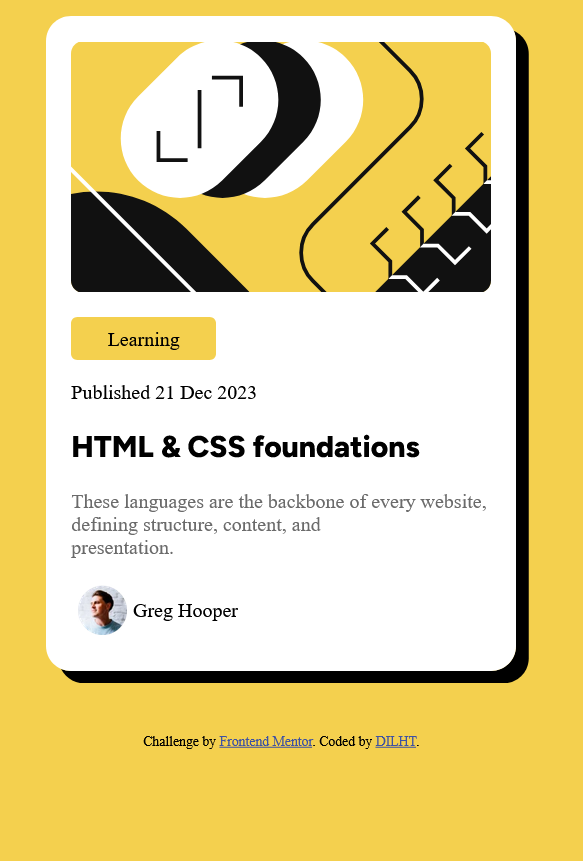

# Frontend Mentor - Blog preview card solution

This is a solution to the [Blog preview card challenge on Frontend Mentor](https://www.frontendmentor.io/challenges/blog-preview-card-ckPaj01IcS). Frontend Mentor challenges help you improve your coding skills by building realistic projects. 

## Table of contents

 
  - [The challenge](#the-challenge)
  - [Screenshot](#screenshot)
  - [Links](#links)
- [My process](#my-process)
  - [Built with](#built-with)
  - [What I learned](#what-i-learned)
  - [Continued development](#continued-development)
  - [Useful resources](#useful-resources)
- [Author](#author)
- [Acknowledgments](#acknowledgments)
 

## Overview

### The challenge

Users should be able to:

- See hover and focus states for all interactive elements on the page

### Screenshot

 

### Links

- Solution URL: [Add solution URL here](https://your-solution-url.com)
- Live Site URL: [Add live site URL here](https://your-live-site-url.com)

## My process
i have used css and html as separate files and i had challenges on maaking the page responsive like 
i was failing to control the card's dimensional but the description paragraph would enlarge the card instead of conforming to the card's dimension
so i used   tag

### Built with

- Semantic HTML5 markup
- CSS custom properties
- Flexbox
 
 
### What I learned
i have learnt how to use word-wrapper css property
and also how i can use the media Query
 i have also learnt about the box-shadow concepts
### Continued development

 i want to improve on laying out elements 

 

### Useful resources
i used blackbox.ai for some of the box shadow conceprts (offsetx,offsety,radius,color)

## Author

- Website - [Add your name here](https://www.your-site.com)
- Frontend Mentor - [@DILHT](https://www.frontendmentor.io/profile/DILHT)
 
 

## Acknowledgments

 